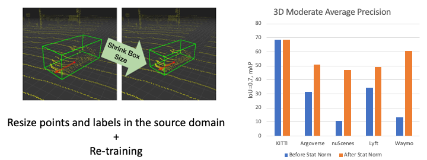

# Train in Germany, Test in The USA: Making 3D Object Detectors Generalize

This paper has been accpeted by Conference on Computer Vision and Pattern Recognition ([CVPR](http://cvpr2020.thecvf.com/)) 2020.

[Train in Germany, Test in The USA: Making 3D Object Detectors Generalize](https://arxiv.org/abs/2005.08139)

by [Yan Wang*](https://www.cs.cornell.edu/~yanwang/), [Xiangyu Chen*](https://www.cs.cornell.edu/~xchen/), [Yurong You](http://yurongyou.com/), [Li Erran](http://www.cs.columbia.edu/~lierranli/), [Bharath Hariharan](http://home.bharathh.info/), [Mark Campbell](https://campbell.mae.cornell.edu/), [Kilian Q. Weinberger](http://kilian.cs.cornell.edu/), [Wei-Lun Chao*](http://www-scf.usc.edu/~weilunc/)



## Dependencies
- [Python 3.6.10](https://www.python.org/downloads/)
- [PyTorch(1.0.0)](http://pytorch.org)

## Usage

### Prepare Datasets ([Jupyter notebook](notebooks/prepare_datasets.ipynb))

We develop our method on these datasets:
- [KITTI object detection 3D dataset](http://www.cvlibs.net/datasets/kitti/eval_object.php?obj_benchmark=3d)
- [Argoverse dataset v1.1](https://www.argoverse.org/data.html)
- [nuScenes dataset v1.0](https://www.nuscenes.org/nuscenes)
- [Lyft Level 5 dataset v1.02](https://self-driving.lyft.com/level5/data/)
- [Waymo dataset v1.0](https://waymo.com/open/data/)

1. Configure `dataset_path` in [config_path.py](config_path.py).

    Raw datasets will be organized as the following structure:
    
    <pre>
    dataset_path/
        | kitti/               # KITTI object detection 3D dataset
            | training/
            | testing/
        | argo/                # Argoverse dataset v1.1
            | train1/
            | train2/
            | train3/
            | train4/
            | val/
            | test/
        | nusc/                # nuScenes dataset v1.0
            | maps/
            | samples/
            | sweeps/
            | v1.0-trainval/
        | lyft/                # Lyft Level 5 dataset v1.02
            | v1.02-train/
        | waymo/               # Waymo dataset v1.0
            | training/
            | validation/
    </pre>

2. Download all datasets.

    For `KITTI`, `Argoverse` and `Waymo`, we provide scripts for automatic download.
    ```bash
    cd scripts/
    python download.py [--datasets kitti+argo+waymo]
    ```
    [nuScenes](https://www.nuscenes.org/download) and [Lyft](https://level5.lyft.com/dataset/download-dataset/) need to downloaded manually.

3. Convert all datasets to `KITTI format`.

    ```bash
    cd scripts/
    python -m pip install -r convert_requirements.txt
    python convert.py [--datasets argo+nusc+lyft+waymo]
    ```

4. Split validation set

    We provide the `train`/`val` split used in our experiments under [split](split/) folder.
    
    ```bash
    cd split/
    python replace_split.py
    ```
   
4. Generate `car` subset

    We filter scenes and only keep those with cars.
    
    ```bash
    cd scripts/
    python gen_car_split.py
    ```

### Statistical Normalization ([Jupyter notebook](notebooks/stat_norm.ipynb))

1. Compute car size statistics of each dataset. 
The computed statistics are stored as `label_stats_{train/val/test}.json` under KITTI format dataset root.

    ```bash
    cd stat_norm/
    python stat.py
    ```

2. Generate rescaled datasets according to car size statistics. 
The rescaled datasets are stored under `$dataset_path/rescaled_datasets` by default.

    ```bash
    cd stat_norm/
    python norm.py [--path $PATH]
    ```
   
### Training (To be updated)

We use [PointRCNN](https://arxiv.org/abs/1812.04244) to validate our method. 

1. Setup PointRCNN

    ```bash
    cd pointrcnn/
    ./build_and_install.sh
    ```

2. Build datasets in PointRCNN format.

    ```bash
    cd pointrcnn/tools/
    python generate_multi_data.py
    python generate_gt_database.py --root ...
    ```

3. Download the models pretrained on source domains from [google drive](https://drive.google.com/drive/folders/14MXjNImFoS2P7YprLNpSmFBsvxf5J2Kw?usp=sharing) using [gdrive](https://github.com/gdrive-org/gdrive/releases/download/2.1.0/gdrive-linux-x64).

    ```bash
    cd pointrcnn/tools/
    gdrive download -r 14MXjNImFoS2P7YprLNpSmFBsvxf5J2Kw
    ```
    
4. Adapt to a new domain by re-training with rescaled data.

    ```bash
    cd pointrcnn/tools/
    
    python train_rcnn.py --cfg_file ...
    ```
   
### Inference
```bash
cd pointrcnn/tools/
python eval_rcnn.py --ckpt /path/to/checkpoint.pth --dataset $dataset --output_dir $output_dir 
```

### Evaluation

We provide [evaluation code](evaluate/evaluate.py#L279) with
- old (based on bbox height) and new (based on distance) difficulty metrics
- <em>output transformation</em> functions to locate domain gap

```bash
python evaluate/
python evaluate.py --result_path $predictions --dataset_path $dataset_root --metric [old/new]
```

## Citation
```
@inproceedings{wang2020train,
  title={Train in germany, test in the usa: Making 3d object detectors generalize},
  author={Yan Wang and Xiangyu Chen and Yurong You and Li Erran and Bharath Hariharan and Mark Campbell and Kilian Q. Weinberger and Wei-Lun Chao},
  booktitle={Proceedings of the IEEE/CVF Conference on Computer Vision and Pattern Recognition},
  pages={11713-11723},
  year={2020}
}
```

